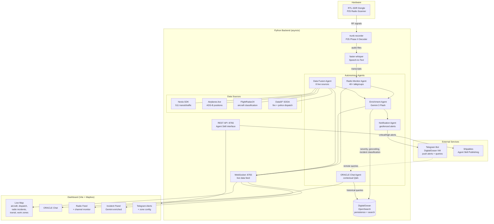

# Monitoring the Situation

An autonomous multi-agent system that perceives the world through radio signals, fuses 10+ real-time data streams, and provides AI-powered situational awareness for San Francisco — all from a MacBook Air with a $25 SDR dongle.



## How It Works

The system streams raw RF signals from an **RTL-SDR** device connected to the server. Those streams are decoded via **trunk-recorder** into P25 trunked radio audio and ingested in real time. Audio from police, fire, and Coast Guard scanner channels is transcribed using [**faster-whisper**](https://github.com/SYSTRAN/faster-whisper), a high-performance CTranslate2-based implementation of OpenAI's Whisper model optimized for low-latency streaming transcription.

All transcripts, dispatch records, aircraft positions, and transit/traffic data are continuously synthesized by **Google Gemini** (DeepMind) into structured events and active threats across San Francisco. Gemini operates with a degree of autonomy — it evaluates severity, correlates signals across data sources, and autonomously triggers push notifications through a **Telegram bot** hosted on a DigitalOcean VM whenever it determines an alert warrants immediate human attention.

## Agents

### Radio Monitor Agent
Runs trunk-recorder to decode P25 Phase II trunked radio from SF's public safety system. Monitors 40+ talkgroups across SFFD, SFPD, EMS, and mutual aid channels. Automatically transcribes every transmission using faster-whisper and routes messages by talkgroup classification.

### Enrichment Agent
Every 5 seconds, Gemini 3 Flash analyzes the latest radio traffic plus all other data feeds. It geocodes mentioned addresses, translates scanner codes (10-codes, signal codes), identifies responding units, classifies incident type and severity, and generates situation summaries. Results are persisted to **DigitalOcean OpenSearch** for historical queries.

### ORACLE Chat Agent
An interactive agent embedded in the dashboard. Ask it "What's happening near SoMa?" or "Any fires in the last hour?" and it queries the live world state plus **OpenSearch** historical data to give you a grounded answer. Uses Gemini with full context injection from all active data feeds.

### Notification Agent
Monitors all enriched incidents against user-configured geofenced zones. When a critical or high-severity event occurs within a watched area, it pushes a formatted alert to Telegram via webhook. Users can also query the system remotely through Telegram commands (`/status`, `/query fire near soma`).

### Data Fusion Agent
Continuously polls and normalizes data from 8 independent sources into a unified world state: radio transcripts, aircraft positions (ADS-B), fire/police dispatch (DataSF), Muni transit vehicles, traffic work zones, traffic events, and service alerts. All data is piped through **Nexla** for normalization and routing.

## Data Sources

| Source | What it provides | Update interval |
|--------|-----------------|-----------------|
| **trunk-recorder** (RTL-SDR) | P25 radio transmissions — SFFD, SFPD dispatch, EMS, mutual aid | 1s file poll |
| **faster-whisper** | Speech-to-text transcription of radio audio | Async per call |
| **Airplanes.live** | All aircraft ADS-B positions within 125nm | 10s |
| **FlightRadar24** | Military, police, helicopter, bizjet classification | 30s |
| **DataSF Fire Dispatch** | Fire/EMS calls with address, type, priority, units | 30s |
| **DataSF Police Dispatch** | Police incidents with disposition and coordinates | 30s |
| **Nexla** | Data integration platform — normalizes and routes 511 transit/traffic feeds | Pipeline |
| **511 SF Bay** (via Nexla) | Muni vehicle positions, work zones, traffic events | 15s |
| **Google Gemini** | Situation enrichment, incident summaries, ORACLE Q&A | 5s cycle |
| **OpenSearch** (DigitalOcean) | Historical transcript/enrichment/incident persistence | On ingest |
| **Telegram Bot** | Push alerts for critical/high-severity incidents, query interface | Real-time |

## Traffic and Transit Data

Traffic and transit feeds for San Francisco are sourced from the **511 SF Bay Open Data API** (Metropolitan Transportation Commission) and ingested through **Nexla dataflows** with dedicated connectors to the 511 REST endpoints. Nexla handles scheduling, normalization, and routing of the raw API responses into the backend pipeline.

### Transit — [511 SF Bay Open Data Specification (Transit)](https://511.org/sites/default/files/pdfs/511%20SF%20Bay%20Open%20Data%20Specification%20-%20Transit.pdf)

The transit spec is a multi-standard REST API combining **SIRI** (Service Interface for Real-time Information) for live data and **GTFS / GTFS-RT** for schedule and bulk feeds. For San Francisco we primarily consume:

- **VehicleMonitoring (SIRI VM)** — real-time Muni vehicle positions, journey progress, delay, and congestion level. This drives the live vehicle layer on the map.
- **StopMonitoring (SIRI SM)** — real-time arrival/departure predictions at individual stops, including vehicle bearing and occupancy.
- **GTFS-RT VehiclePositions** — protobuf-encoded vehicle positions as a redundant/fallback feed.
- **GTFS-RT ServiceAlerts** — active service disruption alerts used to annotate routes on the map.

The Nexla dataflow for transit connects to `api.511.org/transit/`, applies a transformation to normalize SIRI `ServiceDelivery` envelopes and GTFS-RT protobuf payloads into a consistent JSON schema, and delivers records to the backend on a 15-second cadence.

### Traffic — [Open511 Traffic Data Exchange Specification v1.0](https://511.org/sites/default/files/pdfs/Open_511_Data_Exchange_Specification_v1.0_Traffic.pdf)

The traffic spec is a single REST endpoint (`api.511.org/Traffic/Events`) returning **Open511 Event** objects. Each event carries a type (`CONSTRUCTION`, `INCIDENT`, `SPECIAL_EVENT`, `WEATHER_CONDITION`, `ROAD_CONDITION`), a severity level (`MINOR`, `MODERATE`, `MAJOR`), GeoJSON geometry, affected road names with lane state (`CLOSED`, `SOME_LANES_CLOSED`, `ALL_LANES_OPEN`), and impacted systems (road, sidewalk, bike lane). For San Francisco we filter on the `511.org` jurisdiction and active status.

The Nexla dataflow for traffic polls the Events endpoint, applies a transformation to extract and flatten the relevant fields (geometry, severity, road state, schedule), and routes the normalized records into the backend where they feed the traffic event layer and Gemini's situational context.

## Telegram Bot

A dedicated Telegram bot service runs on a **DigitalOcean VM** (separate from the main backend server). Gemini autonomously decides when an incident crosses a severity threshold and pushes structured alert messages to the bot, which delivers them to configured recipients in real time. The bot also functions as a query interface — subscribers can ask natural-language questions about the current situation and receive Gemini-generated responses drawn from live data.

The bot is configured via `TELEGRAM_WEBHOOK_URL` and `TELEGRAM_WEBHOOK_TOKEN` in the `.env`. The DigitalOcean VM runs the bot process independently so alerts remain available even if the main backend is restarted.

## Sponsor Tools

### DigitalOcean — Managed OpenSearch
All radio transcripts, AI enrichments, and incident records are indexed into a **DigitalOcean Managed OpenSearch** cluster for persistence and full-text historical search. The ORACLE agent queries OpenSearch when users ask about past events. Three indices: `radio-transcripts`, `enrichments`, `incidents`. The Telegram bot also runs on a DigitalOcean VM.

### Nexla — Data Integration Platform
The **Nexla SDK** provisions and manages REST API data sources pointing at the 511 SF Bay Open Data API. Nexla handles credential management, source activation, and data normalization for 5 feed types: vehicle positions, work zones, traffic events, stop departures, and service alerts. The backend uses Nexla as its data integration layer for all traffic and transit data.

### Shipables — Agent Skill Publishing
The project publishes a **SKILL.md** agent skill (`sf-situation-monitor`) that lets any compatible AI agent (Claude Code, Cursor, Copilot, etc.) query the system's live REST API — checking aircraft, incidents, transit, radio transcripts, and system status through natural language.

## Map Layers

- **Aircraft** — colored by class (military red, police yellow, helicopter cyan, bizjet purple) with flight trails
- **Dispatch** — fire/medical/police incidents with emoji icons, click for details
- **Radio Incidents** — geocoded P25 transmissions with severity glow rings
- **Traffic & Transit** — Muni vehicles (colored by line), work zones (orange dashed), traffic events

All layers togglable from the sidebar.

## Dashboard Features

- Live radio transcript feed with search and talkgroup filtering
- Channel monitor table showing all active P25 talkgroups
- Incident panel with Gemini-enriched analysis
- ORACLE chat — ask natural language questions about the current situation
- SDR signal stats and frequency activity plot
- Telegram integration — critical incident push alerts with configurable geofenced zones
- REST API on :8766 for external agent integrations

## Agent Skill

The project includes a published agent skill (`sf-situation-monitor/SKILL.md`) that lets any AI coding agent query the system:

```bash
npx @senso-ai/shipables install TeoSlayer/monitoring-the-situation
```

Once installed, an agent can check aircraft, dispatch incidents, transit, radio transcripts, and system health by calling the REST API. See `sf-situation-monitor/SKILL.md` for the full specification.

## Setup

### Prerequisites
```bash
brew install cmake gnuradio rtl-sdr uhd libcurl boost openssl
pip3 install aiohttp websockets python-dotenv requests faster-whisper google-genai opensearch-py nexla-sdk
```

### Configuration
Copy `.env.example` to `.env` and fill in your API keys:
```bash
cp .env.example .env
```

### Build trunk-recorder (one time)
```bash
cd trunk-recorder/build && cmake .. && make -j$(sysctl -n hw.ncpu)
```

### Install frontend dependencies
```bash
cd dashboard && npm install
```

### Run
```bash
# Terminal 1: Backend (starts trunk-recorder + all agents)
cd dashboard/backend && python3 server.py

# Terminal 2: Frontend
cd dashboard && npm run dev
```

Open `http://localhost:5173`

## Project Structure

```
.
├── dashboard/
│   ├── src/
│   │   ├── main.js              # App entry — map setup, WS handlers, layer wiring
│   │   ├── radio.js             # Radio transcript state, filtering, rendering
│   │   ├── chat.js              # ORACLE chat panel (Gemini-powered)
│   │   ├── ws.js                # WebSocket client
│   │   ├── config.js            # API tokens, map center, poll intervals
│   │   ├── emojiIcons.js        # Canvas-rendered emoji for Mapbox symbol layers
│   │   ├── freqplot.js          # Frequency activity sparkline
│   │   ├── style.css            # All styles
│   │   ├── layers/
│   │   │   ├── AircraftLayer.js
│   │   │   ├── DispatchLayer.js
│   │   │   ├── RadioIncidentLayer.js
│   │   │   └── TrafficTransitLayer.js
│   │   └── world/
│   │       ├── WorldState.js    # Global event bus + spatial index
│   │       └── DataLayer.js     # Base class for all map layers
│   ├── backend/
│   │   ├── server.py            # Main backend — polling, transcription, enrichment, WS + REST API
│   │   └── nexla_feeds.py       # 511 traffic/transit data via Nexla SDK
│   ├── index.html
│   ├── vite.config.js
│   └── package.json
├── sf-situation-monitor/
│   ├── SKILL.md                 # Agent skill for querying the REST API
│   └── scripts/status.sh        # Quick status check script
├── trunk-recorder-config.json   # RTL-SDR device config + P25 control channels
├── talkgroups.csv               # CCSF talkgroup ID → name/group/category mapping
└── RESEARCH.md                  # Radio frequency research notes
```

## Hardware

- MacBook Air (M-series)
- RTL-SDR v3 dongle ($25) — 24 MHz to 1.766 GHz
- Antenna pointed at San Francisco from the WorkOS office

## Tech Stack

**Frontend**: Vite, Mapbox GL, Deck.gl, H3-js, vanilla JS |
**Backend**: Python asyncio, aiohttp, websockets |
**AI**: Gemini 3 Flash (enrichment + ORACLE), faster-whisper (transcription) |
**Radio**: trunk-recorder (P25 Phase II), GNU Radio, RTL-SDR |
**Data**: Nexla SDK (511 feeds), DataSF SODA, Airplanes.live, FlightRadar24 |
**Persistence**: DigitalOcean Managed OpenSearch |
**Alerts**: Telegram webhook on DigitalOcean VM |
**Skill**: Shipables.dev (Agent Skills standard)

## Radio Intelligence Notes

- SF Fire/EMS (talkgroups 925–955): **100% unencrypted** P25 Phase II
- SFPD dispatch (talkgroups 804–829): dispatcher side in the clear, field units encrypted
- Mutual aid (talkgroups 835–889): all unencrypted interop channels
- P25 control channel is always in the clear — reveals unit IDs, talkgroup activity, timing
